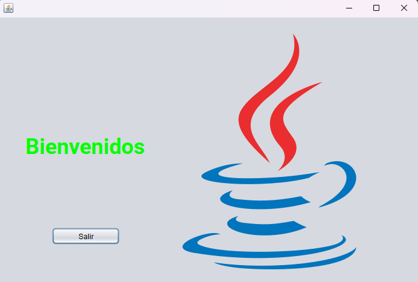

<h1 align="center">Hi 👋, I'm Christian Ariel Garay</h1>
<h3 align="center">A passionate frontend developer from Argentina</h3>

- 🌱 I’m currently learning **Laravel, Phyton, Java Full Stack**

- 📫 How to reach me **christiangarayw8@gmail.com**

- 📄 Know about my experiences [https://www.linkedin.com/in/christian-garay959](https://www.linkedin.com/in/christian-garay959)

<h3 align="left">Connect with me:</h3>

<h3 align="left">Languages and Tools:</h3>
  

<a href="https://github.com/toby959/interfases/README.md" >

    
<a href="https://github.com/toby959/interfases/README.md" >

